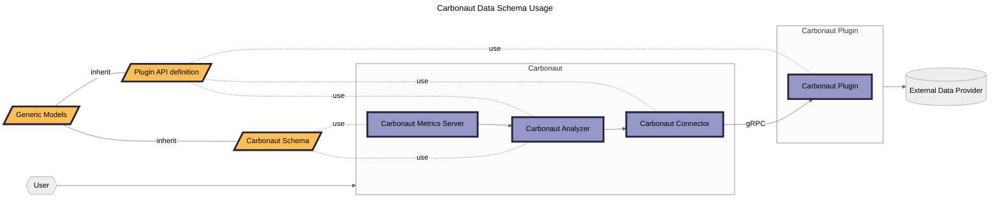

# Carbonaut API schema

The Carbonaut schema is structured in three folders.

* **Plugin API definition** (`plugin/*.proto`): defines the gRPC API the Carbonaut Connector component and external plugins implement to transport data. The data transported are data transport objects (DTOs).
* **Carbonaut Schema**: (`schema/*.proto`): defines the integrated and analyzed data collected from connected plugins.
* **Generic Models** (`models/*.proto`): defines general models that are used in the `plugin` and `schema` definitions (e.g. model: Location).

Consider the diagram below to understand how the data schemas and api definitions are used in Carbonaut.
For a more comprehensive overview have a look to the [data schema](https://carbonaut.cloud/docs/concepts/schema) and [architecture](https://carbonaut.cloud/docs/concepts/architecture) documentation.

The `Plugin API definition` defines a gRPC service and with that a DTO Carbonaut data schema.
The `Carbonaut Plugin` implements the gRPC server and transforms the data scraped from the `External Data Provider` into schema.

The `Carbonaut Analyzer` translates the `Plugin API definition` schema to the `Carbonaut Schema` while enriching and mixing the data scraped.
The `Carbonaut Metrics Server` translates the `Carbonaut Schema` into OpenTelemetry metrics (Gauge, Histograms, etc.).

For a more comprehensive overview have a look to the [data schema](https://carbonaut.cloud/docs/concepts/schema) and [architecture](https://carbonaut.cloud/docs/concepts/architecture) documentation.
