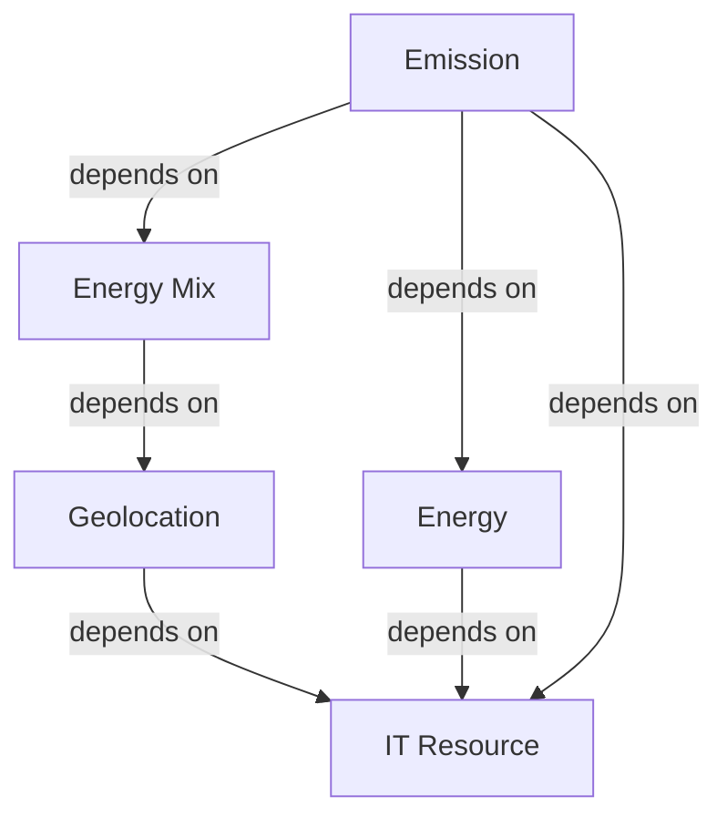
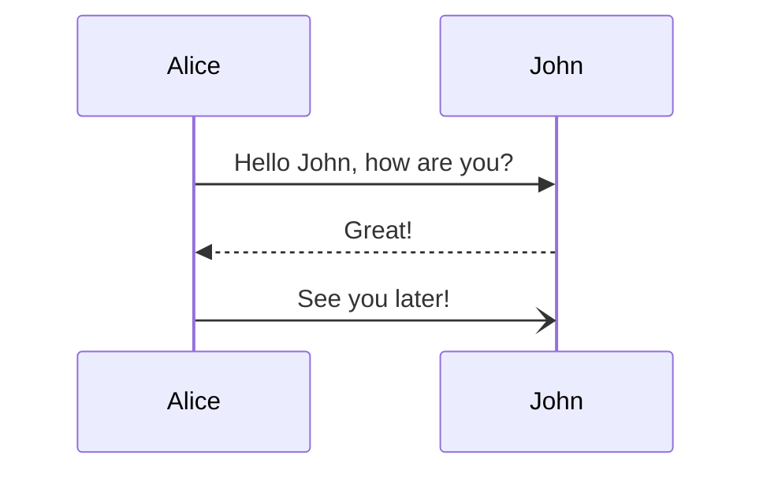

To get an overview of the resource consumption of a cloud native system, you need to combine different data sources with each other. Carbonaut should be the platform to facilitate the data integration and transformation. To explore the architecture of the carbonaut system we first start with the data sources.

## Data Sources

These data sources can be integrated dynamically (we add a data stream to the system) or static as (we use a configuration file to select a formular).

**Dynamic Data Sources**:
* **Energy**: Energy metrics that gives us information about joules used which can be mapped to KwH.
* **IT Resources**: IT Resources that include various hardware information like CPU type, CPU cores, storage, DRAM etc.
* **Geolocation**: geolocation (longitude, latitude) based on IP address
* **Energy Mix**: current energy mix for the specified geolocation

**Static Data Sources**:
* **Emission**: formualar to estimate the emissions based on the energy consumption, energy mix and IT resource typ.

These data sources depend on each other. 

From this diagram its clear that in order to expose data about the emissions of the system, it is required to first collect all the other data sources of the system.

Each of these types of data 

# Architecture Overview

`Version 1.0 April 2024`

This document describes the architecture of the Carbonaut project. Iterations on the architecture as well as deep dives into certain parts are written up in dedicated files.

## 1. Overview

This documentation follows the [Google Software Design Document](https://docs.google.com/document/d/1pgMutdDasJb6eN6yK6M95JM8gQ16IKacxxhPXgeL9WY/edit#heading=h.lomckg6w5y6) structure.

### 1.1. Purpose
<!-- Brief description of the focus of this module of the overall project and its intended audience. -->

Carbonaut is used to collect, integrate, and publish metrics related to the sustainability of cloud native environments. It seamlessly integrates with the observability stack in a cloud native setting.

Environmental considerations and awareness of resource usage are generally emerging fields in economics, compelling us to discover innovative approaches for our products and services. For instance, we are transitioning from fast fashion to sustainable fashion, from coal to renewables, and from gasoline-powered to electric and hydrogen vehicles. This requires building an understanding of the supply chain and taking responsibility for how your products or services are assembled. These sustainable transformations vary in impact and quality but affect everything, including software engineering. Software represents another transformation in our economies, challenging current business models in various aspects. Sustainable software engineering merges these transformations.

In the realm of software, we find areas like distributed systems and cloud computing, which are major consumers of energy. It is estimated that the energy consumed by data centers globally emits more greenhouse gases than the aviation industry. Therefore, there is a pressing need to engage in this transformation and shape cloud technology in a more sustainable manner. Fortunately, this field is not confined to private companies but is a significant and industry-relevant area known as cloud native.
<!-- In software engineering we face challenges understanding the actual resource footprint of our services due to the invisibility factor of software. More over the  -->

<!-- TODO: This is not a new discussion in software engineering. We know -->

### 1.2. Scope
<!-- Describe the scope of the module to be produced -->

This project focuses on the development of a single module that may be extended through plugins. If developed plugins should be integrated directly into the module, resulting in a single binary. There may also be an option to deploy multiple instances of this module to support higher throughput.

The primary role of the module is not to collect metrics itself; rather, it integrates with other tools that generate these metrics. However, to enhance the quality of the metrics by combining and refining them, such functionality can be incorporated within the module.

### 1.3. Requirements
<!-- Your mileage may vary -- we typically break down the requirements to provide a ballpark estimate. -->

#### 1.3.1. Functional Requirements**:
- **Plugin Integration and Management**: The system must support the integration of plugins directly into the main module, creating a unified binary. The module must provide an interface for loading and managing plugins. All plugins will follow a common integration structure which has to be defined. The "kinds" of a plugin is defined by the data required by the system. One data type, one plugin.
- **Data Collection and Integration**: While the module itself will not collect metrics directly, it must integrate seamlessly with external interfaces and tools that provide these metrics. The system must normalize data from various sources to a common schema suitable for analysis and reporting. The exposed metrics should be in [opentelemetry](https://opentelemetry.io/) format.
- **Metric Enhancement**: The module should have the capability to enhance the quality of metrics by combining data from multiple sources if reasonable. For example, in order to estimate carbon emissions energy, it resource and energy data needs to be caluclated.
- **Scalability and Deployment**: The system should support deployment in both single and multiple module configurations to facilitate varying levels of throughput. Ensure that the system can scale horizontally to manage increased load by adding more instances as required.
- **Data Privacy and Security**: Implement standard security measures to protect data integrity and confidentiality during the data collection and integration processes. Compliance with relevant data protection regulations must be ensured. <!-- GDPR -->

#### 1.3.2. Non-Functional Requirements:
- **Performance**: The system must process data efficiently, ensuring minimal latency in metric availability. Performance benchmarks should be established, particularly for data processing speeds and response times <100 milliseconds and in bulk <5 second.
- **Reliability**: The system must be robust, with capabilities to handle failures gracefully and ensure continuous operation. In the event that a module fails any modules that depend on it will either stop execution or publish parts of the requested data if available for later analysis. The user should have an interface to be aware of any failures happening. Upcon recovery modules should automatically restart, seaminglessly integrating already collected data if present with new data.
- **Usability**: The interface for managing plugins and configurations must be user-friendly, catering to technical users. Logs generated through using the system can be either send to the terminal or written in a file for further analysis. The system provides documentation on system setup, configuration, and management.
- **Maintainability**: The code base should be documented on a separate website and structured in such a way that easy maintenance and future upgrades are possible. The code follows common standards in terms of lining, inline comments and unit, integration and other testing if appropiate. In this way, it adheres to coding standards that promote code readability and reusability.
- **Interoperability**: The module should be compatible with existing and commonly used cloud native tools and platforms. Support for open standards and protocols to ensure seamless integration with a variety of data sources and tools.
- **Open Source Development**: The project is developed as open source project from the start. This includes a public repository, documentation, feature management, development and community structures (if required).

## 2. System Architecture
<!-- Describe/include a figure of the overall system architecture (and where this module fits in) -->

### 2.1. Context

Carbonaut fits in a cloud native system.

### 2.2. Plugins

### 2.3. Internal Components / Building Blocks

### 2.4. Deployment

## 3. Data Dictionary
<!-- Brief description of each element in this module or a link to an actual data dictionary -->

## 4. Software Domain Design

### 4.1. Software Application Domain Chart
<!-- Describe / chart each major software application domain and the relationships between objects (UML, etc) -->

### 4.2. Software Application Domain
<!-- A Comprehensive high level description of each domain (package/object wherever it is better to start) within the scope of this module (or within the greater scope of the project if applicable) -->

#### 4.2.1. Domain X
<!-- A high level description of the family of components within this domain and their relationship. Include database domain, stored procedures, triggers, packages, objects, functions, etc. -->

##### 4.2.1.1. Component Y of Domain X
<!-- Define Component Y, describe data flow/control at component level -->

###### 4.2.1.1. Task Z of Component Y1 of Domain X
<!-- Define Task Z, describe data flow/control at task level -->

## 5. Data Design

<!-- Describe the data contained in databases and other shared structures between domains or within the scope of the overall project architecture -->

Since the module does not store the data itself but rather exposes it, no additional database is required. 

scalability and performance

security considerations related to data

### 5.1. Persistent/Static Data
<!-- Describe/illustrate the logical data model or entity relationship diagrams for the persistent data (or static data if static) -->

#### 5.1.1. Dataset
<!-- Describe persisted object/dataset and its relationships to other entities/datasets -->

#### 5.1.1. Static Data
<!-- Describe static data -->

#### 5.1.1. Persisted data
<!-- Describe persisted data -->

There is none persistent data. There may be data stored at runtime based on failures of plugins within the module which can force another plugin to "hold on the data" until the other plugin was restarted, the application shut down or no memory is left.

### 5.2. Transient/Dynamic Data
<!-- Describe any transient data, include any necessary subsections -->

This is the main part of the application.

### 5.3. External Interface Data
<!-- Any external interfaces’ data goes here (this is for the data, section 8 is for the interface itself) -->

### 5.4. Transformation of Data
<!-- Describe any data transformation that goes on between design elements -->

## 6. User Interface

### 6.1. User Interface Design Overview
<!-- Pictures, high level requirements, mockups, etc. -->

### 6.2. User Interface Navigation Flow
<!-- Diagram the flow from one screen to the next -->

### 6.3. Use Cases / User Function Description
<!-- Describe screen usage / function using use cases, or on a per function basis -->

## 7. External Interfaces

<!-- Identify any external interfaces used in the execution of this module, include technology and other pertinent data -->

### 7.1. Interface X
<!-- Describe interactions, protocols, message formats, failure conditions, handshaking, etc -->

## 8. Comments

## 9. References

## 10. Glossary
