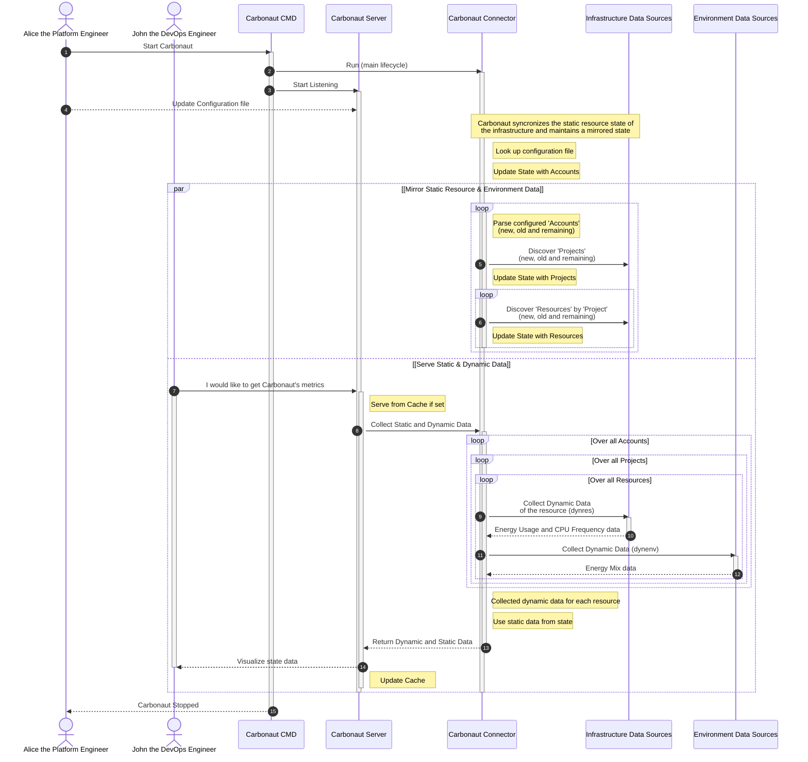

## **Carbonaut Components**

Carbonaut has a couple of internal components which are explained in this document.

This document focuses on the center component "Connector". Information about the User Interface around the Carbonaut Server is documented [here](/docs/concepts/server/). The integration of external data sources about providers is documented [here](/docs/concepts/data-providers/). 

### Connector: Internal Building Blocks

At a higher level, Carbonaut integrates data over providers (see [Data Provider docs](/docs/concepts/data-providers)), and exposes collected data over a server (see [Server API docs](/docs/reference/server-api/)). Between these two components is the **Connector** component which contains the main lifecycle of the system.

#### Internal Runtime

The connector, parses the configuration, starts and stopps plugins, updates the local state which contains the topology of the IT infrastructure and collects data from all connected providers which the API server exposes in different formats. A simplified version of the runtime is visualized below.

