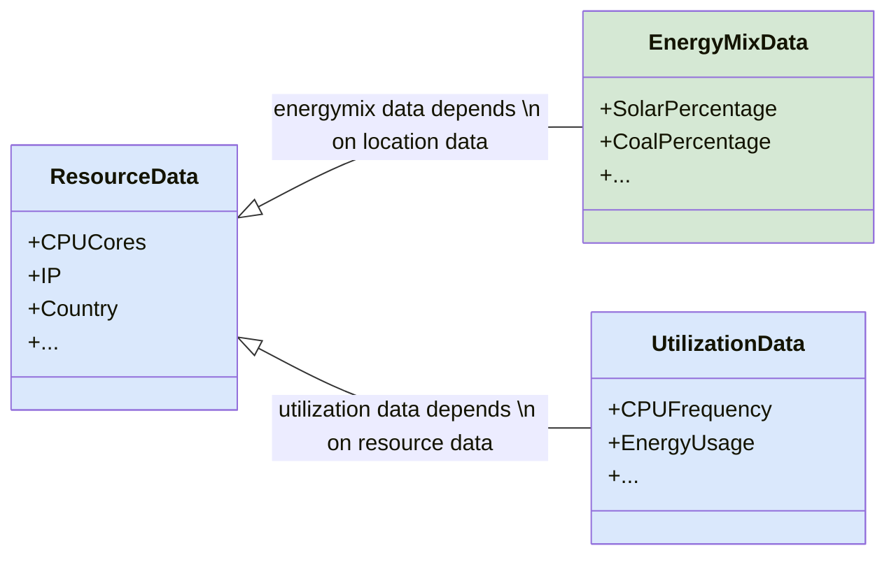

## **Carbonaut Data Providers**

Carbonaut collects data of your infrastructure over data providers. Providers are interfaces which are implemented as plugins (see Plugin section in the sidebar). There are three different kinds of providers:

- `Dynamic Environment Provider` collects data about the Energy Mix (may be extended).
- `Dynamic Resource Provider` collects data about Energy Usage, CPU Frequency etc. (may be extended).
- `Static Resource Provider` collects data about CPU, Memory, IP etc. and also data about the geolocation and region of the IT resource.



<--->



These providers depend on each other. To collect energy usage of a system you first need to be aware of the system's topology. In the cloud environment we have heterogenous systems which changes dynamically. Therefore Resources are captured in projects (like K8s namespace's) and accounts (like K8s cluster's). The static resource provider just references the account and further discovery of projects and resources are done at runtime.

